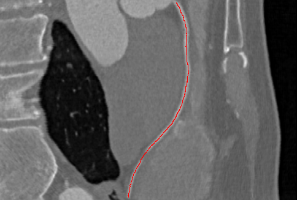

#Description
Assuming that we already know the image of the centerline, we want the lumen to be displayed on a plane, which requires curved projection reformation(CPR).The figure below is a common coronary centerline display in the paper.

#Function introduction
##The center line is a representation of a series of points.
You can call the function *cpr(img_name, center_line_name)* directly, where *img_name* represents the path of the image and *center_line_name* represents the path of the centerline point. The former supports *.nii.gz* and *.mha* files. The latter only supports *.npy* files.
##The center line is represented by a 3D image.
You need to first convert the centerline image into a series of sequential points. Here provides a minimum path method for continuous centerline extraction, which is called *find_point_list(thin_label_name, start, end)*, where *thin_label_name* is the path of 3D image, *start* is the coordinates of the starting point of the center line and *end* is the coordinates of the ending point of the center line.This function will save the center line as an *.npy* file.